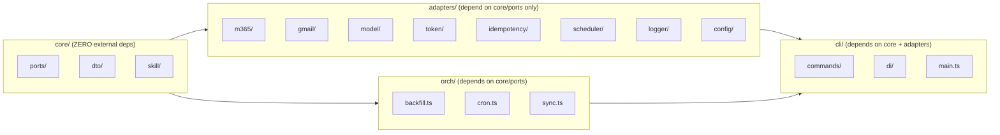
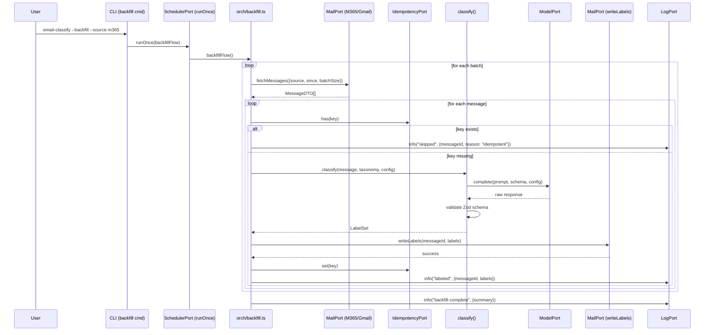
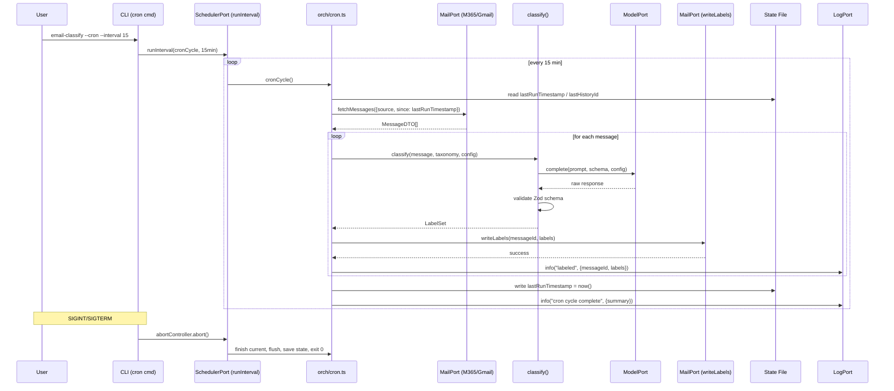
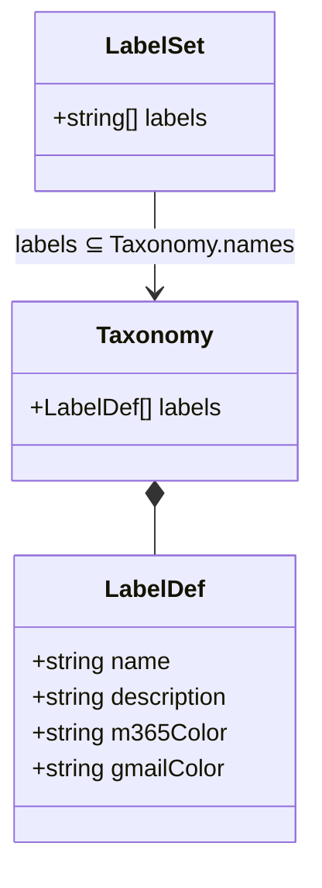

# Architecture Diagrams

## System Context (Hexagonal / Ports & Adapters)

```mermaid
flowchart TB
    subgraph CLI["CLI / Main (wires adapters)"]
        Main[main.ts]
        DI[DI Container]
    end

    subgraph Adapters["Adapters (implement Ports)"]
        M365A[M365Adapter\nMailPort]
        GmailA[GmailAdapter\nMailPort]
        JevA[JevAdapter\nModelPort]
        OpenAIA[OpenAIAdapter\nModelPort]
        TokenA[KeychainTokenStore\nTokenPort]
        IdemA[SqliteIdempotencyStore\nIdempotencyPort]
        SchedA[SimpleScheduler\nSchedulerPort]
        LogA[PinoLogger\nLogPort]
        ConfigA[ConfigLoader\nConfigPort]
    end

    subgraph Core["Skill Core (ZERO deps)"]
        Classify[classify(message, taxonomy, config, modelPort)\n→ LabelSet]
        Prompt[prompt.ts\n(template + few-shots)]
        Schema[schema.ts\n(Zod LabelSet)]
        Tax[taxonomy.ts\n(loads taxonomy.yaml)]
        Ports[Ports:\nMailPort, ModelPort,\nTokenPort, IdempotencyPort,\nSchedulerPort, LogPort, ConfigPort]
        DTOs[DTOs:\nMessageDTO, LabelSet,\nTaxonomy, LabelDef,\nModelConfig, TokenSet,\nFetchOpts]
    end

    subgraph Orch["Orchestration (uses Core Ports)"]
        Backfill[backfill.ts]
        Cron[cron.ts]
        Sync[sync.ts]
    end

    subgraph CLI_Cmds["CLI Commands"]
        AuthCmd[auth.ts]
        BackfillCmd[backfill.ts]
        CronCmd[cron.ts]
        SyncCmd[sync-categories.ts]
    end

    Main --> DI
    DI --> M365A
    DI --> GmailA
    DI --> JevA
    DI --> OpenAIA
    DI --> TokenA
    DI --> IdemA
    DI --> SchedA
    DI --> LogA
    DI --> ConfigA

    M365A --> Core
    GmailA --> Core
    JevA --> Core
    OpenAIA --> Core
    TokenA --> Core
    IdemA --> Core
    SchedA --> Core
    LogA --> Core
    ConfigA --> Core

    Core --> Orch
    Orch --> Backfill
    Orch --> Cron
    Orch --> Sync

    DI --> CLI_Cmds
    CLI_Cmds --> Orch
    CLI_Cmds --> M365A
    CLI_Cmds --> GmailA
    CLI_Cmds --> TokenA
    CLI_Cmds --> Sync
```

## Dependency Direction (Enforced)



## Data Flow: Backfill Mode



## Data Flow: Cron Mode



## MessageDTO Shape

```mermaid
classDiagram
    class MessageDTO {
        +string id
        +string internetMessageId
        +string subject
        +string bodyPreview
        +Sender sender
        +string receivedDateTime
        +string[] existingLabels
        +Source source
        +unknown raw
    }
    class Sender {
        +string email
        +string name
    }
    enum Source {
        m365
        gmail
    }
    MessageDTO *-- Sender
    MessageDTO ..> Source
```

## LabelSet Schema



## Port Interfaces (TypeScript)

```typescript
// core/ports/MailPort.ts
interface MailPort {
  fetchMessages(opts: FetchOpts): Promise<MessageDTO[]>;
  writeLabels(messageId: string, labels: string[]): Promise<void>;
  ensureCategories(labels: LabelDef[]): Promise<void>;
}

interface FetchOpts {
  source: "m365" | "gmail";
  since?: string;           // ISO date
  batchSize?: number;
  folder?: string;
}

// core/ports/ModelPort.ts
interface ModelPort {
  complete(prompt: string, schema: JsonSchema, config: ModelConfig): Promise<unknown>;
}

interface ModelConfig {
  provider: "jev" | "openai" | "anthropic" | "custom";
  model: string;
  apiKeyEnvVar: string;
  temperature: number;
  maxTokens: number;
  extraParams?: Record<string, unknown>;
}

// core/ports/TokenPort.ts
interface TokenPort {
  get(provider: "m365" | "gmail"): Promise<TokenSet>;
  set(provider: "m365" | "gmail", tokens: TokenSet): Promise<void>;
  delete(provider: "m365" | "gmail"): Promise<void>;
}

interface TokenSet {
  accessToken: string;
  refreshToken?: string;
  expiresAt?: number;
}

// core/ports/IdempotencyPort.ts
interface IdempotencyPort {
  has(key: string): Promise<boolean>;
  set(key: string): Promise<void>;
}

// core/ports/SchedulerPort.ts
interface SchedulerPort {
  runOnce(fn: () => Promise<void>): Promise<void>;
  runInterval(fn: () => Promise<void>, intervalMs: number): Promise<AbortController>;
}

// core/ports/LogPort.ts
interface LogPort {
  debug(message: string, context?: Record<string, unknown>): void;
  info(message: string, context?: Record<string, unknown>): void;
  warn(message: string, context?: Record<string, unknown>): void;
  error(message: string, context?: Record<string, unknown>): void;
}

// core/ports/ConfigPort.ts
interface ConfigPort {
  load(): Promise<Config>;
}

interface Config {
  taxonomy: string;                    // path to taxonomy.yaml
  model: ModelConfig;
  m365: { enabled: boolean; folders: string[]; batchSize: number };
  gmail: { enabled: boolean; labels: string[]; batchSize: number };
  cron: { intervalMinutes: number };
  backfill: { batchSize: number; since: string | null };
  logging: { level: string; fileRetentionDays: number; maxFileSizeMB: number };
  idempotency: { storePath: string };
}
```